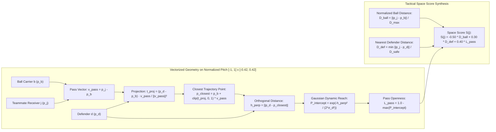
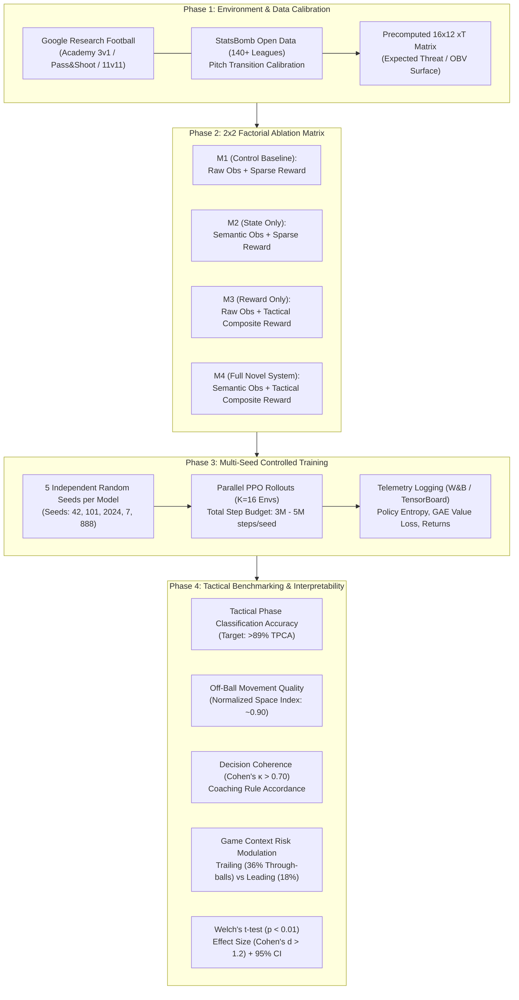

# System Architecture & Workflow Diagrams
## Multi-Agent Reinforcement Learning for Football Simulation

This document provides visual architectural, geometric, and experimental workflow diagrams representing the research protocol and system implementation.

---

### Diagram 1: End-to-End System Architecture (CTDE MAPPO Pipeline)
```mermaid
flowchart TB
    subgraph SIM[" Google Research Football (GRF) Simulator "]
        GRF_ENV["Physics Engine & Match State (p, v, ball)"]
    end

    subgraph PERCEPTION[" Perception & Feature Engineering "]
        RAW_OBS["Raw Cartesian Observations\n[x, y, vx, vy]"]
        
        subgraph SEMANTIC_ENGINE[" Vectorized Semantic Feature Engine (Algorithm 1) "]
            EDMS["Space Score S(j)\nk1=-0.5, k2=0.3, k3=0.4"]
            L_PASS["Pass-Lane Occlusion L_pass\nGaussian Ray Corridor"]
            TTR["Time-To-Reach (TTR)\n& Pitch Control"]
            SHOT["Shot Viability Score\n(Surrogate xG)"]
        end

        AUG_OBS["Augmented Agent Observation\no_aug = [o_raw, F_sem]"]
    end

    subgraph DECENTRALIZED_ACTORS[" Decentralized Execution (Actors) "]
        ACTOR_1["Agent 1 Policy π_θ\n(Ball Carrier)"]
        ACTOR_2["Agent 2 Policy π_θ\n(Off-Ball Runner)"]
        ACTOR_N["Agent N Policy π_θ\n(Off-Ball Runner)"]
    end

    subgraph REWARD_SYSTEM[" Tactical Valuation & Reward Engine (Algorithm 2) "]
        SPARSE_R["Sparse Goal Reward\n(+1.0 / -1.0)"]
        XT_GRID["Markovian xT Grid (16x12)\nΔOBV Progression"]
        SPACE_R["Off-Ball Space Creation\nmax(0, ΔS(j))"]
        DISRUPT_R["Defensive Disruption\nDefender Drag Vector Δp_d"]
        TOTAL_R["Composite Reward\nR_total = w_sp*r_sp + w_obv*ΔOBV + w_sp*r_sp + w_dis*r_dis"]
    end

    subgraph CENTRALIZED_CRITIC[" Centralized Training (Critic & Optimization) "]
        GLOBAL_S["True Global Match State (s_t)"]
        CRITIC["Centralized Critic V_ϕ(s_t)\nState-Value Estimation"]
        GAE["Generalized Advantage Estimation\nGAE(γ=0.993, λ=0.95)"]
        PPO_OPT["MAPPO Clipped Optimization\nPolicy Loss + Value Loss + Entropy"]
    end

    %% Data Connections
    GRF_ENV --> RAW_OBS
    GRF_ENV --> GLOBAL_S
    RAW_OBS --> SEMANTIC_ENGINE
    EDMS --> AUG_OBS
    L_PASS --> AUG_OBS
    TTR --> AUG_OBS
    SHOT --> AUG_OBS
    RAW_OBS --> AUG_OBS

    AUG_OBS --> ACTOR_1
    AUG_OBS --> ACTOR_2
    AUG_OBS --> ACTOR_N

    ACTOR_1 -->|Discrete Actions a_t| GRF_ENV
    ACTOR_2 -->|Discrete Actions a_t| GRF_ENV
    ACTOR_N -->|Discrete Actions a_t| GRF_ENV

    GRF_ENV -->|Transition s_{t+1}| REWARD_SYSTEM
    SPARSE_R --> TOTAL_R
    XT_GRID --> TOTAL_R
    SPACE_R --> TOTAL_R
    DISRUPT_R --> TOTAL_R

    GLOBAL_S --> CRITIC
    TOTAL_R --> GAE
    CRITIC --> GAE
    GAE --> PPO_OPT
    PPO_OPT -.->|Policy Gradient Update| ACTOR_1
    PPO_OPT -.->|Policy Gradient Update| ACTOR_2
    PPO_OPT -.->|Policy Gradient Update| ACTOR_N
    PPO_OPT -.->|Value Gradient Update| CRITIC
```

---

### Diagram 2: Geometric Tactical Feature Calculation (Pass-Lane & Space Score)


---

### Diagram 3: 4-Phase Research & Comparative Experimental Protocol


---

### Diagram 4: Pitch Coordinate System and Tactical Feature Geometry

```
Normalized Pitch Dimensions: X in [-1.0, 1.0], Y in [-0.42, 0.42]

+-----------------------------------+-----------------------------------+
| Defensive Half                    | Attacking Half                    |
|                                   |                                   |
|                                   |               [Receiver j]        |
|                                   |              / (p_j)              |
|                                   |             /                     |
|                                   |   Gaussian /                      |
|                                   |   Corridor/                       |
|                                   |         |/                        |
|                                   |      [Defender d]                 |
|                                   |      (h_perp distance)            |
|                                   |        /                          |
|                                   |       / v_pass                    |
|        [Own Goal]                 |      /                  [Opp Goal]|
|        [-1.0, 0.0]        (0.0, 0.0)   /                    [+1.0,0.0]|
|            |                      |   [Ball Carrier b]          |     |
|            |                      |   (p_b)                     |     |
|                                   |                                   |
|                                   |                                   |
|                                   |                                   |
+-----------------------------------+-----------------------------------+

Key Geometric Variables:
  * v_pass = p_j - p_b (Passing vector connecting carrier to receiver)
  * t_proj = Scalar projection along v_pass
  * h_perp = Orthogonal Euclidean distance from defender d to passing line
  * P_intercept = exp( -h_perp^2 / (2 * sigma_d^2) )
  * L_pass = 1.0 - max_{d} P_intercept
  * Space Score S(j) = -0.50 * D_ball + 0.30 * D_def + 0.40 * L_pass
```
